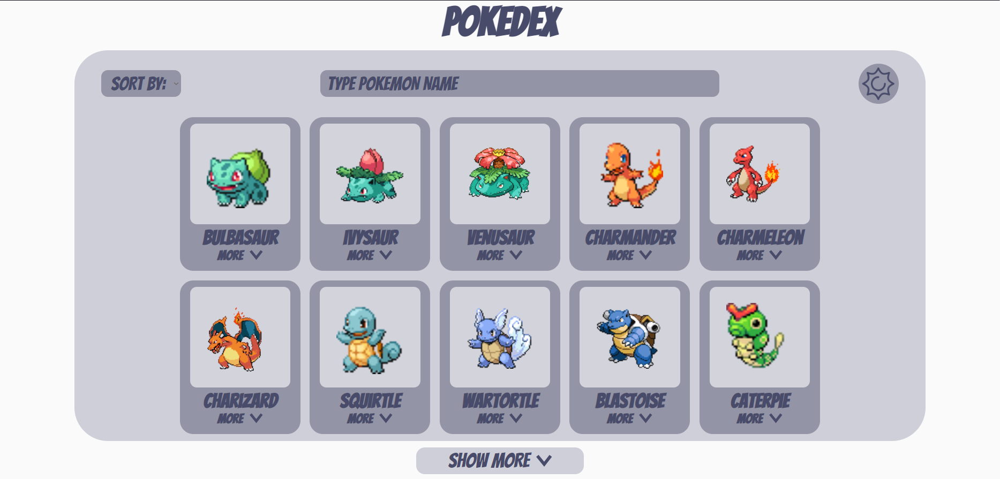

<br/>
<p align="center">
  <a href="https://github.com/Eduardo071/pokedex-react">
    
  </a>

  <h3 align="center">Pokedex with React.js</h3>

  <p align="center">
    Pokedex desenvolvida com a tecnologia React.js
    <br/>
    <br/>
<a href="https://www.figma.com/file/Mjkq59dMNWNuf6gsRujTgH/Pokedex_design?type=design&node-id=0%3A1&mode=design&t=7AahfgbjH8fxLtAg-1"><strong>Veja o protótipo »</strong></a>
<br/>
    <a href="https://github.com/Eduardo071/pokedex-react"><strong>Leia a documentação »</strong></a>
    <br/>
    <br/>
    <a href="https://github.com/Eduardo071/pokedex-react/issues">Reporte um Bug</a>
    .
  </p>
</p>

     

## Table Of Contents

* [Sobre o projeto](#sobre-o-projeto)
* [Desenvolvido com](#desenvolvido-com)
* [Introdução](#introdução)
  * [Pré requisitos](#pre-requisitos)
  * [Instalação](#instalacao)
* [Uso](#uso)
* [Licença](#licenca)
* [Autor](#autor)

## Sobre o projeto



Esse projeto da pokedex com react possui duas páginas de navegação interna (SPA).

Em ambas páginas temos um botão(Toggler) que troca o tema de Light para Dark e vice-versa, o que permite mais conforto ao gosto visual do usuário.

A página inicial é a página Home, onde é listado 10 pokemons, e temos um botão para mostrar mais, que exibe mais 10 pokemons sempre que é clicado.

Temos um filtro de tipos de pokemon na Home, onde irá listar 10 pokemons do tipo selecionado, e sempre que clicar no botão irá mostrar mais 10 pokemons.

Também na Home, tem um campo de busca, que permite filtrar pelo nome do pokemon, é importante lembrar que esse filtro busca nos pokemons que estão renderizados na tela.

Por fim, temos a página de descrição do pokemon, contendo o nome, imagem,tipo(s), descrição do pokemon, movimentos e habilidades do pokémon.

## Desenvolvido com

Esse projeto foi desenvolvido utilizando:


* [Figma](https://www.figma.com)
* [React.js](https://react.dev)
* [React-Router](https://v5.reactrouter.com/)
* [Styled-components](https://styled-components.com)
* [Context-api](https://react.dev/learn/passing-data-deeply-with-context)

## Introdução

Para instalar esse projeto localmente em sua máquina, basta seguir o passo a passo.

### Pré requisitos

Você irá precisar ter alguns pré-requisitos para instalar o projeto localmente, como:

* npm

você irá precisar instalar o gerenciador de pacotes NPM.

```sh
npm install npm@latest -g
```

### Instalação

1. Com o NPM instalado, faça o download do arquivo ZIP do projeto.

2. Extraia o arquivo .zip para algum local, através do terminal, navegue até a pasta, caso a pasta esteja na raiz do disco local C por exemplo, basta dar o seguinte comando:

```sh
cd /c/pokedex-react
```

3. Agora basta instalar as dependências do projeto.

```sh
npm install
```

4. Pronto, projeto instalado com sucesso!!

## Uso

O objetivo do projeto em si, é para se divertir vendo as características dos pokemons, como habilidades, movimentos e até os tipos do pokemon.

## Licença

Distributed under the MIT License. See [LICENSE](https://github.com/Eduardo071/pokedex-react/blob/main/LICENSE.md) for more information.

## Autor

* **Eduardo071** - *Desenvolvedor Web Front-End* - [Eduardo071](https://github.com/Eduardo071) - *Protótipo e Código*
